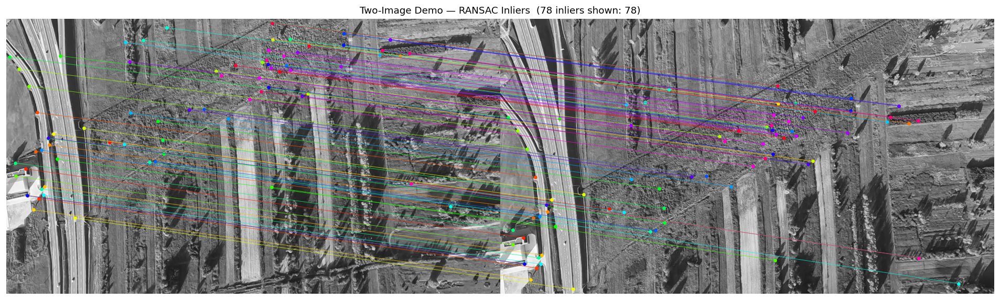
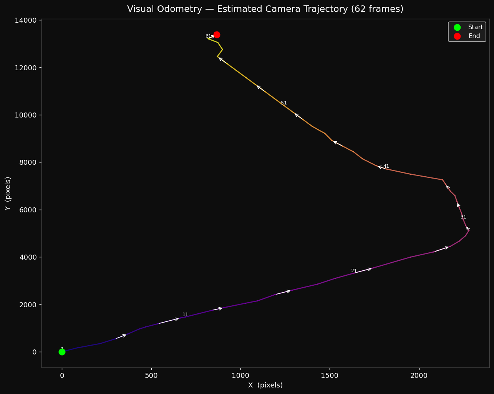

# Visual Odometry - MPC Module
### *Implementation of Motion Positioning Component using Aerial Image Sequences*

> **Course project**: AVS (Advanced Vision Systems)  
> **Dataset**: [Aerial Image Matching Benchmark Dataset](https://dx.doi.org/10.21227/jd5s-ay89) by Tomasz Pogorzelski, IEEE DataPort 2025  
> **Method**: ORB-inspired keypoint pipeline + RANSAC homography, implemented from scratch in Python/NumPy

---

## Results

**Feature matches between two consecutive frames (RANSAC inliers)**

<p align="center">
  
</p>

<!-- two_image_demo.png is 1907×574 px; -->


**Estimated flight trajectory - 62 frames**

<p align="center">
  
</p>

<!-- trajectory.png is 1286×1026 px; displayed at width=702 → height≈560 px -->

---

## What this project does

Given a sequence of **62 aerial photographs** taken from a UAV flying over a village, the system:

1. Detects characteristic corner features in each frame (FAST + Harris)
2. Describes them with a compact 256-bit binary fingerprint (rBRIEF)
3. Matches those fingerprints across consecutive frames (Hamming distance + Lowe ratio test)
4. Rejects geometrically inconsistent matches (RANSAC)
5. Extracts the camera translation from the surviving matches
6. Accumulates translations into a **full flight trajectory** - no GPS, no IMU, camera only

---

## Algorithm pipeline

Each consecutive frame pair goes through 8 steps:

```
Frame N-1 ──┐
             ├─► FAST detection ──► Harris scoring ──► NMS
Frame N   ──┘         │                                 │
                       └──────── rBRIEF descriptor ◄────┘
                                        │
                              Hamming BF matching
                            + Lowe ratio test (0.75)
                                        │
                           RANSAC homography (5 px thr)
                                        │
                             tx = H[0,2],  ty = H[1,2]
                                        │
                              cx += tx,  cy += ty  ──► trajectory
```

| # | Step | Key detail |
|---|------|-----------|
| 1 | **FAST detection** | 16-pixel Bresenham circle test, threshold=20, OpenCV |
| 2 | **Harris corner scoring** | R = det(M) - 0.04·trace(M)², precomputed as full response map |
| 3 | **NMS** | Grid-cell bucketing O(N); keeps strongest point per `radius×radius` cell |
| 4 | **Intensity-centroid orientation** | θ = atan2(m₀₁, m₁₀) over 31×31 patch |
| 5 | **rBRIEF descriptor** | 256 preoptimised pairs rotated by θ, packed into 4×uint64 |
| 6 | **Hamming matching** | Vectorised N×M distance matrix via 16-bit LUT popcount |
| 7 | **RANSAC + Homography** | `cv2.findHomography(..., cv2.RANSAC, 5.0)` |
| 8 | **Translation extraction** | tx = H[0,2], ty = H[1,2] + kinematic clamping (Δmax=300 px) |

**Robustness features in main.py:**
- `n_min=10` consensus gate - minimum RANSAC inliers to accept an estimate
- `delta_max=300` kinematic clamp - rejects physically impossible jumps
- Constant-velocity fallback - uses last known translation only when inliers == 0

---

## Project structure

```
AVS-Visual-Odometry/
├── main.py                        # Pipeline entry point (62 frames → trajectory)
├── demo_two_images.py             # Two-image comparison demo (custom pair)
├── orb_descriptor_positions.txt   # 256 ML-optimised BRIEF pixel-pair offsets
├── src/
│   ├── orb.py                     # FAST · Harris · NMS · orientation · rBRIEF
│   ├── matching.py                # Hamming BF matching · ratio test
│   └── visualization.py           # Match strips · keypoint overlay · trajectory plot
└── images/
    └── sequence/                  # UAV frames (see Dataset section below)
```

---

## Dataset

Images come from the **Aerial Image Matching Benchmark Dataset** published on IEEE DataPort:

The dataset consists of UAV photographs captured at 20× zoom with associated GPS coordinates, altitude, yaw and camera orientation metadata. It was originally created for UAV-to-satellite image matching research. We use a 62-frame subsequence showing a low-altitude flyover of a village, which provides a challenging mix of textured farmland, roads, and dense forest canopy.

**To reproduce:** download the dataset from IEEE DataPort, prepare the data and place frames as `images/sequence/1.jpg` … `images/sequence/n.jpg`.

---

## Quick start

```bash
# 1. Install dependencies
pip install opencv-python numpy matplotlib

# 2. Run the full pipeline on 62 frames
python main.py \
    --images_dir images/sequence \
    --pairs_file orb_descriptor_positions.txt \
    --output_dir output \
    --threshold 20 \
    --n_best 500 \
    --save_strips

```

**Outputs:**
- `output/trajectory.png` - colour-coded flight path with direction arrows
- `output/matches/pair_NNN.png` - match strip for every frame pair (with `--save_strips`)

---

## Key parameters

| Flag | Default | Effect |
|------|---------|--------|
| `--threshold` | 20 | FAST sensitivity; lower detects more corners |
| `--n_best` | 500 | Keypoints kept per frame after Harris + NMS |
| `--n_matches` | 300 | Candidates passed to RANSAC |
| `--ransac_thr` | 5.0 | Max reprojection error for RANSAC inliers (px) |
| `--n_min` | 10 | Minimum inliers to accept an estimate (below → fallback) |
| `--delta_max` | 300.0 | Max allowed translation per frame (px) |
| `--save_strips` | off | Save per-pair match visualisation images |

---

## The `orb_descriptor_positions.txt` file

Contains **256 rows**, each `x1 y1 x2 y2` - pixel offsets for one binary intensity test.  
These pairs were optimised by machine learning (Rublee et al., 2011 ORB paper) to be maximally informative and minimally correlated. Before descriptor computation each pair is **rotated by the keypoint's orientation angle θ**, giving rotation-invariant rBRIEF descriptors.

---

## Results

Running on the 62-frame village flyover sequence:

```
Mean inliers / pair  :  96.2
Min  inliers         :   0  (dense forest frames → fallback used)
Max  inliers         : 277
Cumulative path length: 14 091 px
Final position       : (+809, +13 330) px
```
---

## References

1. Tomasz Pogorzelski (2025) - Rozprawa doktorska; System samolokalizacji wizyjnej dla latających platform bezzałogowych
2. Lowe (2004) - *Distinctive image features from scale-invariant keypoints* (ratio test)
3. Fischler & Bolles (1981) - *Random Sample Consensus* (RANSAC)
4. Scaramuzza & Fraundorfer (2011) - *Visual Odometry: Part I - The First 30 Years and Fundamentals*
5. Tomasz Pogorzelski (2025) - *Aerial Image Matching Benchmark Dataset*, IEEE DataPort

---
